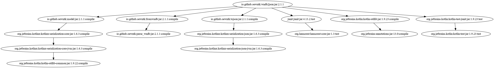

# Open English Wordnet WNDB-to-JSON grinder

This library reads a model from WNDB files and writes it to JSON format.

Project [grind_wndb2json](https://github.com/oewntk/grind_wndb2json)

See also [model](https://github.com/oewntk/model/blob/master/README.md).

See also [fromwndb](https://github.com/oewntk/fromwndb/blob/master/README.md).

See also [tojson](https://github.com/oewntk/tojson/blob/master/README.md).

See also [oewntk](https://github.com/oewntk)
and [globalwordnet/english-wordnet](https://github.com/globalwordnet/english-wordnet).

## Dataflow

This library reads from the WNDB files.

This output conforms to the **JSON** standards.

## Command line

`grind.sh [WNDB] [JSON]`

grinds the JSON database

*where*

[WNDB] directory where WNDB files are

[JSON] path to JSON output

## Maven Central

		<groupId>io.github.oewntk</groupId>
		<artifactId>wndb2json</artifactId>
		<version>1.0.0</version>

## Dependencies

